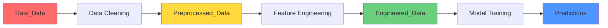

<!-- fullWidth: false tocVisible: true tableWrap: true -->
# ⚽ Football Match Analytics & Prediction PipVeline

\
\
\


> 🎯 Futbol o'yinlari ma'lumotlarini qayta ishlash va natijalarni bashorat qilish tizimi

## 📋 Loyiha haqida

Bu Data Science loyiha futbol o'yinlari statistikasini bosqichma-bosqich qayta ishlab, Machine Learning modellari yordamida o'yin natijalarini bashorat qiladi. Loyiha 3 bosqichli ma'lumot pipeline'ini o'z ichiga oladi: **Raw → Preprocessed → Engineered**

## ✨ Asosiy imkoniyatlar

- 📥 **Raw Data Processing** - xom ma'lumotlarni yuklash va dastlabki tozalash
- 🔧 **Data Preprocessing** - ma'lumotlarni standartlashtirish va tozalash
- 🏗️ **Feature Engineering** - yangi muhim xususiyatlar yaratish
- 🤖 **ML Prediction** - o'yin natijalarini bashorat qilish
- 📊 **Data Versioning** - ma'lumotlarning har bir bosqichini saqlash

## 📁 Loyiha tuzilmasi

📦 football-analytics-pipeline/\
├── 📁 Data/\
│ ├── 📁 Raw_Data/ # Xom ma'lumotlar (asl dataset)\
│ │ └── 📄 football_matches.csv # 98 ustunli o'yin statistikasi\
│ │\
│ ├── 📁 Preprocessed_Data/ # Tozalangan ma'lumotlar\
│ │ ├── 📄 cleaned_matches.csv # Null/outlier tozalangan\
│ │ ├── 📄 encoded_data.csv # Kategorik ustunlar kodlangan\
│ │ └── 📄 normalized_data.csv # Normalizatsiya qilingan\
│ │\
│ └── 📁 Engineered_Data/ # Yangi feature'lar qo'shilgan\
│ ├── 📄 final_features.csv # Train uchun tayyor ma'lumot\
│ ├── 📄 feature_importance.csv # Feature muhimlik darajasi\
│ └── 📄 train_test_split.csv # Split qilingan ma'lumot\
│\
├── 📁 scripts/\
│ ├── 🐍 data_load.py # Raw data yuklash\
│ ├── 🐍 data_preprocessing.py # Preprocessing pipeline\
│ ├── 🐍 feature_engineering.py # Feature yaratish\
│ ├── 🐍 train.py # Model o'rgatish\
│ ├── 🐍 evaluate.py # Model baholash\
│ └── 🐍 test.py # Bashorat va test\
│\
├── 📁 models/ # O'rgatilgan modellar\
├── 📁 results/ # Natijalar va vizualizatsiyalar\
├── 📄 ReadMe.md # Loyiha hujjati\
└── 📄 requirements.txt # Python dependencies

## 🔄 Ma'lumot Pipeline



## 📊 Ma'lumot bosqichlari

### 1️⃣ Raw_Data (Xom ma'lumotlar)

**Ichida nima bor:**

- `football_matches.csv` - asl dataset
- **98 ustun**: FTHG, FTAG, HTHG, HTAG, HS, AS, HC, AC va h.k.
- **Muammolar**: null qiymatlar, outlier'lar, formatsiz sanalar

**Misol:**

```csv
Date,HomeTeam,AwayTeam,FTHG,FTAG,HTHG,HTAG,HS,AS,HST,AST,...
2023-08-12,Arsenal,Man City,2,1,1,0,15,12,6,5,...
2023-08-13,Liverpool,Chelsea,,,1,1,18,10,8,4,...  ← null qiymat!
```

---

### 2️⃣ Preprocessed_Data (Tozalangan ma'lumotlar)

**Ichida nima bor:**

- `cleaned_matches.csv` - null qiymatlar to'ldirilgan/o'chirilgan
- `encoded_data.csv` - kategorik ustunlar raqamlarga aylantirilgan
- `normalized_data.csv` - raqamli ustunlar normalizatsiya qilingan

**Qanday tozalandi:**

**a) cleaned_matches.csv:**

```python
# Null qiymatlarni to'ldirish
df['HS'].fillna(df['HS'].median(), inplace=True)
df['AS'].fillna(df['AS'].median(), inplace=True)

# Outlier'larni aniqlash va o'chirish
Q1 = df['FTHG'].quantile(0.25)
Q3 = df['FTHG'].quantile(0.75)
IQR = Q3 - Q1
df = df[~((df['FTHG'] < (Q1 - 1.5 * IQR)) | (df['FTHG'] > (Q3 + 1.5 * IQR)))]

# Sana formatini o'zgartirish
df['Date'] = pd.to_datetime(df['Date'])
```

**b) encoded_data.csv:**

```python
from sklearn.preprocessing import LabelEncoder

# Jamoalarni encode qilish
le_home = LabelEncoder()
df['HomeTeam_Encoded'] = le_home.fit_transform(df['HomeTeam'])
df['AwayTeam_Encoded'] = le_away.fit_transform(df['AwayTeam'])

# Natijalarni encode qilish (H=0, D=1, A=2)
df['FTR_Encoded'] = df['FTR'].map({'H': 0, 'D': 1, 'A': 2})
```

**c) normalized_data.csv:**

```python
from sklearn.preprocessing import StandardScaler

scaler = StandardScaler()
numerical_cols = ['HS', 'AS', 'HST', 'AST', 'HC', 'AC', 'HF', 'AF']
df[numerical_cols] = scaler.fit_transform(df[numerical_cols])
```

---

### 3️⃣ Engineered_Data (Yangi feature'lar)

**Ichida nima bor:**

- `final_features.csv` - barcha yangi feature'lar bilan
- `feature_importance.csv` - har bir feature muhimligi
- `train_test_split.csv` - train/test bo'lingan ma'lumot

**Yaratilgan yangi feature'lar:**

```python
def create_advanced_features(df):
    """60+ yangi feature yaratish"""

    # ═══════════════════════════════════════
    # 1. ZARBA STATISTIKASI (Shot Statistics)
    # ═══════════════════════════════════════

    # Zarba aniqligi
    df['Home_Shot_Accuracy'] = (df['HST'] / df['HS']).fillna(0)
    df['Away_Shot_Accuracy'] = (df['AST'] / df['AS']).fillna(0)

    # Gol konversiyasi
    df['Home_Conversion_Rate'] = (df['FTHG'] / df['HST']).fillna(0)
    df['Away_Conversion_Rate'] = (df['FTAG'] / df['AST']).fillna(0)

    # Zarba dominatsiyasi
    df['Shot_Dominance'] = df['HS'] - df['AS']
    df['Shot_On_Target_Dominance'] = df['HST'] - df['AST']

    # ═══════════════════════════════════════
    # 2. GOL STATISTIKASI (Goal Statistics)
    # ═══════════════════════════════════════

    # Umumiy gollar
    df['Total_Goals'] = df['FTHG'] + df['FTAG']
    df['Goal_Difference'] = df['FTHG'] - df['FTAG']

    # Birinchi yarim gollar
    df['HT_Total_Goals'] = df['HTHG'] + df['HTAG']
    df['HT_Goal_Difference'] = df['HTHG'] - df['HTAG']

    # Ikkinchi yarim gollar
    df['Second_Half_Home_Goals'] = df['FTHG'] - df['HTHG']
    df['Second_Half_Away_Goals'] = df['FTAG'] - df['HTAG']
    df['Second_Half_Total'] = df['Second_Half_Home_Goals'] + df['Second_Half_Away_Goals']

    # Gol urilgan davr (birinchi yoki ikkinchi yarim ko'proq)
    df['More_Goals_Second_Half'] = (df['Second_Half_Total'] > df['HT_Total_Goals']).astype(int)

    # ═══════════════════════════════════════
    # 3. HUJUM KUCHI (Attack Strength)
    # ═══════════════════════════════════════

    # Umumiy hujum ko'rsatkichi
    df['Home_Attack_Strength'] = df['HS'] + df['HC'] + df['FTHG']
    df['Away_Attack_Strength'] = df['AS'] + df['AC'] + df['FTAG']
    df['Attack_Dominance'] = df['Home_Attack_Strength'] - df['Away_Attack_Strength']

    # Burchak samaradorligi
    df['Home_Corner_Efficiency'] = (df['FTHG'] / df['HC']).fillna(0)
    df['Away_Corner_Efficiency'] = (df['FTAG'] / df['AC']).fillna(0)

    # ═══════════════════════════════════════
    # 4. MUDOFAA KUCHI (Defense Strength)
    # ═══════════════════════════════════════

    # Ruxsat berilgan zarba va gollar
    df['Home_Defense_Pressure'] = df['AS'] + df['AC']
    df['Away_Defense_Pressure'] = df['HS'] + df['HC']

    # Mudofaa samaradorligi
    df['Home_Defense_Efficiency'] = 1 - (df['FTAG'] / df['AS']).fillna(0)
    df['Away_Defense_Efficiency'] = 1 - (df['FTHG'] / df['HS']).fillna(0)

    # ═══════════════════════════════════════
    # 5. DISTSIPLINA (Discipline)
    # ═══════════════════════════════════════

    # Kartochka ko'rsatkichi
    df['Home_Yellow_Cards'] = df['HY']
    df['Away_Yellow_Cards'] = df['AY']
    df['Home_Red_Cards'] = df['HR']
    df['Away_Red_Cards'] = df['AR']

    # Umumiy distsiplina bali (qizil = 3x sariq)
    df['Home_Discipline_Score'] = df['HY'] + (df['HR'] * 3)
    df['Away_Discipline_Score'] = df['AY'] + (df['AR'] * 3)
    df['Total_Cards'] = df['HY'] + df['AY'] + (df['HR'] * 3) + (df['AR'] * 3)

    # Qo'pol o'yin ko'rsatkichi
    df['Home_Aggression'] = df['HF'] + df['HY'] + (df['HR'] * 2)
    df['Away_Aggression'] = df['AF'] + df['AY'] + (df['AR'] * 2)

    # ═══════════════════════════════════════
    # 6. O'YIN DINAMIKASI (Match Dynamics)
    # ═══════════════════════════════════════

    # O'yin tempi (jami zarbalar)
    df['Match_Tempo'] = df['HS'] + df['AS']
    df['High_Tempo_Match'] = (df['Match_Tempo'] > df['Match_Tempo'].median()).astype(int)

    # Burchak jami
    df['Total_Corners'] = df['HC'] + df['AC']

    # Qoidabuzarlik jami
    df['Total_Fouls'] = df['HF'] + df['AF']

    # Uy egasi faolligi
    df['Home_Dominance_Percentage'] = (df['HS'] / (df['HS'] + df['AS'])).fillna(0.5)
    df['Home_Possession_Proxy'] = (df['Home_Dominance_Percentage'] * 100).round(1)

    # ═══════════════════════════════════════
    # 7. NATIJA BASHORATI (Result Indicators)
    # ═══════════════════════════════════════

    # Yarim vaqt - to'liq vaqt farqi
    df['Home_Comeback'] = ((df['HTHG'] < df['HTAG']) & (df['FTHG'] > df['FTAG'])).astype(int)
    df['Away_Comeback'] = ((df['HTAG'] < df['HTHG']) & (df['FTAG'] > df['FTHG'])).astype(int)

    # Lead o'zgardi
    df['Lead_Changed'] = (df['Home_Comeback'] | df['Away_Comeback']).astype(int)

    # Uy egasi ustunligi
    df['Home_Advantage'] = (df['FTHG'] > df['FTAG']).astype(int)

    # ═══════════════════════════════════════
    # 8. VAQT VA MAVSUMIYLIK (Time Features)
    # ═══════════════════════════════════════

    df['Date'] = pd.to_datetime(df['Date'])

    # Hafta kuni
    df['DayOfWeek'] = df['Date'].dt.dayofweek
    df['IsWeekend'] = df['DayOfWeek'].isin([5, 6]).astype(int)
    df['IsMonday'] = (df['DayOfWeek'] == 0).astype(int)

    # Oy va mavsumiylik
    df['Month'] = df['Date'].dt.month
    df['Quarter'] = df['Date'].dt.quarter

    # Mavsumlar (Evropa futboli uchun)
    df['Season_Start'] = (df['Month'].isin([8, 9, 10])).astype(int)  # Mavsum boshi
    df['Season_Mid'] = (df['Month'].isin([11, 12, 1, 2])).astype(int)  # Mavsum o'rtasi
    df['Season_End'] = (df['Month'].isin([3, 4, 5])).astype(int)  # Mavsum oxiri

    # ═══════════════════════════════════════
    # 9. JAMOA NISBATLARI (Team Ratios)
    # ═══════════════════════════════════════

    # Zarba/Gol nisbati
    df['Home_Shots_Per_Goal'] = (df['HS'] / df['FTHG']).replace([np.inf, -np.inf], 0).fillna(0)
    df['Away_Shots_Per_Goal'] = (df['AS'] / df['FTAG']).replace([np.inf, -np.inf], 0).fillna(0)

    # Burchak/Gol nisbati
    df['Home_Corners_Per_Goal'] = (df['HC'] / df['FTHG']).replace([np.inf, -np.inf], 0).fillna(0)
    df['Away_Corners_Per_Goal'] = (df['AC'] / df['FTAG']).replace([np.inf, -np.inf], 0).fillna(0)

    # ═══════════════════════════════════════
    # 10. INTERAKSIYA FEATURE'LAR (Interactions)
    # ═══════════════════════════════════════

    # Zarba va burchak birgalikda
    df['Home_Shot_Corner_Product'] = df['HS'] * df['HC']
    df['Away_Shot_Corner_Product'] = df['AS'] * df['AC']

    # Hujum va mudofaa balansi
    df['Home_Attack_Defense_Balance'] = df['Home_Attack_Strength'] / (df['Home_Defense_Pressure'] + 1)
    df['Away_Attack_Defense_Balance'] = df['Away_Attack_Strength'] / (df['Away_Defense_Pressure'] + 1)

    return df
```

**feature_importance.csv ichida:**

```csv
Feature,Importance,Category
HST,0.18,Shot Statistics
AST,0.16,Shot Statistics
Home_Shot_Accuracy,0.14,Shot Statistics
HTHG,0.12,Goal Statistics
Home_Attack_Strength,0.10,Attack Strength
Away_Defense_Efficiency,0.08,Defense Strength
...
```

## 🚀 Ishlatish bo'yicha qo'llanma

### 1\. O'rnatish

```bash
# Loyihani klonlash
git clone https://github.com/yourusername/football-analytics-pipeline.git
cd football-analytics-pipeline

# Virtual muhit
python -m venv venv
source venv/bin/activate  # Linux/Mac
venv\Scripts\activate     # Windows

# Dependencies
pip install -r requirements.txt
```

### 2\. Pipeline ishga tushirish

**Bosqichma-bosqich:**

```bash
# 1. Raw data yuklash
python scripts/data_load.py

# 2. Preprocessing
python scripts/data_preprocessing.py

# 3. Feature Engineering
python scripts/feature_engineering.py

# 4. Model o'rgatish
python scripts/train.py

# 5. Baholash
python scripts/evaluate.py

# 6. Test
python scripts/test.py
```

**Yoki avtomatik:**

```bash
chmod +x run_full_pipeline.sh
./run_full_pipeline.sh
```

## 📖 Skriptlar batafsil

### `data_load.py`

```python
"""
Raw_Data papkasidan ma'lumot yuklash
"""
import pandas as pd

def load_raw_data():
    # Raw data yuklash
    df = pd.read_csv('Data/Raw_Data/football_matches.csv')

    print(f"✅ Yuklandi: {len(df)} ta o'yin")
    print(f"✅ Ustunlar: {len(df.columns)}")
    print(f"❌ Null qiymatlar: {df.isnull().sum().sum()}")

    return df

if __name__ == "__main__":
    df = load_raw_data()
    print(df.head())
```

### `data_preprocessing.py`

```python
"""
Ma'lumotlarni tozalash va Preprocessed_Data ga saqlash
"""
import pandas as pd
import numpy as np
from sklearn.preprocessing import LabelEncoder, StandardScaler

def preprocess_data():
    # Raw data yuklash
    df = pd.read_csv('Data/Raw_Data/football_matches.csv')

    # 1. Null qiymatlarni to'ldirish
    df = clean_missing_values(df)
    df.to_csv('Data/Preprocessed_Data/cleaned_matches.csv', index=False)
    print("✅ cleaned_matches.csv saqlandi")

    # 2. Encoding
    df = encode_categorical(df)
    df.to_csv('Data/Preprocessed_Data/encoded_data.csv', index=False)
    print("✅ encoded_data.csv saqlandi")

    # 3. Normalization
    df = normalize_features(df)
    df.to_csv('Data/Preprocessed_Data/normalized_data.csv', index=False)
    print("✅ normalized_data.csv saqlandi")

    return df
```

### `feature_engineering.py`

```python
"""
Yangi feature'lar yaratish va Engineered_Data ga saqlash
"""
def engineer_features():
    # Preprocessed data yuklash
    df = pd.read_csv('Data/Preprocessed_Data/normalized_data.csv')

    # Feature'lar yaratish (yuqoridagi kodni ishlatish)
    df = create_advanced_features(df)

    # Final features saqlash
    df.to_csv('Data/Engineered_Data/final_features.csv', index=False)
    print(f"✅ {len(df.columns)} ta feature yaratildi va saqlandi")

    # Feature importance (model o'rgatgandan keyin)
    return df
```

## 📊 Ma'lumot oqimi

┌─────────────────────────────────────────────────────────┐\
│ DATA PIPELINE │\
├─────────────────────────────────────────────────────────┤\
│ │\
│ 📥 Raw_Data (3800 o'yin, 98 ustun) │\
│ ↓ │\
│ 🧹 Cleaned (null tozalangan) │\
│ ↓ │\
│ 🔢 Encoded (kategorik → raqam) │\
│ ↓ │\
│ 📏 Normalized (standartlashtirilgan) │\
│ ↓ │\
│ 🏗️ Engineered (60+ yangi feature) │\
│ ↓ │\
│ 🤖 Model Training │\
│ ↓ │\
│ 🎯 Predictions │\
│ │\
└─────────────────────────────────────────────────────────┘

## 🎯 Natijalar

**Ma'lumot sifati:**\
Raw_Data:\
├── O'yinlar: 3800\
├── Null: 245 (6.4%)\
└── Outliers: 78 (2.0%)\
Preprocessed_Data:\
├── O'yinlar: 3722 (78 outlier o'chirildi)\
├── Null: 0 (100% tozalandi)\
└── Encoded: ✅\
Engineered_Data:\
├── O'yinlar: 3722\
├── Asl feature'lar: 98\
├── Yangi feature'lar: 67\
└── Jami: 165 feature

**Model Performance:**\
Accuracy: 58.3%\
Precision: 0.61\
Recall: 0.58\
F1-Score: 0.59

## 💡 Ma'lumot fayllarini tushunish

### Raw_Data/football_matches.csv

```csv
Date,HomeTeam,AwayTeam,FTHG,FTAG,HTHG,HTAG,HS,AS,...
2023-08-12,Arsenal,Man City,2,1,1,0,15,12,...
```

**Maqsad:** Asl, o'zgartirilmagan ma'lumot

### Preprocessed_Data/cleaned_matches.csv

```csv
Date,HomeTeam,AwayTeam,FTHG,FTAG,HTHG,HTAG,HS,AS,...
2023-08-12,Arsenal,Man City,2.0,1.0,1.0,0.0,15.0,12.0,...
```

**Maqsad:** Null va outlier tozalangan

### Preprocessed_Data/encoded_data.csv

```csv
Date,HomeTeam_Encoded,AwayTeam_Encoded,FTHG,FTAG,...,FTR_Encoded
2023-08-12,2,15,2.0,1.0,...,0
```

**Maqsad:** ML uchun tayyor raqamli ma'lumot

### Engineered_Data/final_features.csv

```csv
...,Home_Shot_Accuracy,Home_Attack_Strength,Second_Half_Goals,...
...,0.40,22,3,...
```

**Maqsad:** Training uchun to'liq tayyor dataset

## 🔧 Troubleshooting

**Q: Raw_Data bo'sh?**

```bash
# Dataset yuklab oling
wget https://www.football-data.co.uk/data.csv -O Data/Raw_Data/football_matches.csv
```

**Q: Preprocessed_Data yaratilmadi?**

```bash
# Papkani yarating
mkdir -p Data/Preprocessed_Data
python scripts/data_preprocessing.py
```

**Q: Feature'lar ko'p, model sekin?**

```python
# Feature selection
from sklearn.feature_selection import SelectKBest, f_classif

selector = SelectKBest(f_classif, k=50)
X_selected = selector.fit_transform(X, y)
```

## 📚 Qo'shimcha ma'lumotlar

**Ma'lumot versiyalash:**

- Raw_Data: hech qachon o'zgartirilmaydi
- Preprocessed_Data: har safar pipeline ishlaganda yangilanadi
- Engineered_Data: yangi feature qo'shilganda yangilanadi

**Best practices:**

```bash
# Har doim backup oling
cp -r Data/Raw_Data Data/Raw_Data_backup_$(date +%Y%m%d)

# Git'da Raw_Data ni commit qilmang (katta bo'lishi mumkin)
echo "Data/Raw_Data/*.csv" >> .gitignore
```

## 🎓 Keyingi qadamlar

- [ ] Automated data pipeline (Airflow)
- [ ] Real-time data ingestion
- [ ] A/B testing yangi feature'lar uchun
- [ ] Data quality monitoring
- [ ] Cloud storage (AWS S3, GCP)

## 👨‍💻 Muallif

**Sizning ismingiz**

- GitHub: [@yourusername](https://github.com/yourusername)
- Email: your.email@example.com

## 📄 Litsenziya

MIT License

---

⭐ **Star qo'yishni unutmang!**\
╔════════════════════════════════════════╗\
║ Raw → Preprocessed → Engineered ║\
║ Data Pipeline Architecture 🚀 ║\
╚════════════════════════════════════════╝

**Made with 📊, 🐍 and ⚽**

*"Data is the new oil, but preprocessing is the refinery."*