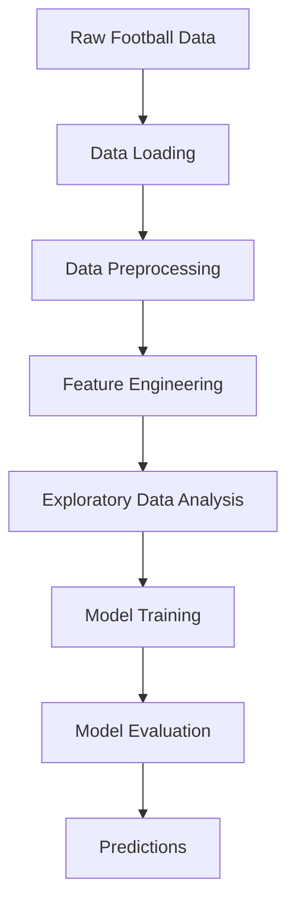

Ajoyib! Endi to'g'ri README.md yozaman - futbol go'llari tahlili va ML model loyihasi uchun! ⚽
markdown# ⚽ Football Goals Prediction & Analysis


> 🎯 Futbolchilarning yillik go'llar sonini tahlil qilish va bashorat qilish loyihasi

## 📋 Loyiha haqida

Bu Data Science loyiha futbolchilarning yillik go'llar sonini tahlil qiladi va Machine Learning modellar yordamida kelajakdagi ko'rsatkichlarni bashorat qiladi. Loyiha turli xil statistik tahlillar va vizualizatsiyalarni o'z ichiga oladi.

## ✨ Asosiy imkoniyatlar

- 📊 **Ma'lumotlar tahlili** - futbolchilar statistikasini chuqur tahlil qilish
- 🤖 **ML Modellar** - go'llar sonini bashorat qilish
- 📈 **Vizualizatsiya** - grafik va diagrammalar
- 🔍 **Feature Engineering** - muhim xususiyatlarni aniqlash
- 📉 **Trend tahlili** - vaqt bo'yicha o'zgarishlarni kuzatish

## 📁 Loyiha tuzilmasi

📦 football-goals-analysis/
├── 📓 data_loading.ipynb # Ma'lumotlarni yuklash va dastlabki ko'rish
├── 📓 data_preprocessing.ipynb # Ma'lumotlarni tozalash va tayyorlash
├── 📓 feature_creation.ipynb # Yangi feature'lar yaratish
├── 📓 data_analysis.ipynb # Chuqur tahlil va vizualizatsiya
├── 📓 .ipynb # ML model va bashorat
├── 📄 ReadMe.md # Loyiha hujjati
└── 📁 data/ # Ma'lumotlar papkasi (agar bo'lsa)

## 🛠️ Texnologiyalar

### Data Science Stack

- **Python 3.x** - asosiy dasturlash tili
- **Pandas** - ma'lumotlarni qayta ishlash
- **NumPy** - matematik hisob-kitoblar
- **Matplotlib & Seaborn** - vizualizatsiya
- **Scikit-learn** - Machine Learning modellari
- **Jupyter Notebook** - interaktiv tahlil

### Mumkin bo'lgan ML Modellari

- Linear Regression
- Random Forest
- Gradient Boosting
- XGBoost
- Neural Networks (agar ishlatilgan bo'lsa)

## 🚀 O'rnatish va ishga tushirish

### 1. Repositoriyani klonlash

```bash
git clone https://github.com/yourusername/football-goals-analysis.git
cd football-goals-analysis
```

### 2. Virtual muhit yaratish

```bash
# Virtual muhit yaratish
python -m venv venv

# Faollashtirish (Windows)
venv\Scripts\activate

# Faollashtirish (Mac/Linux)
source venv/bin/activate
```

### 3. Kutubxonalarni o'rnatish

```bash
pip install pandas numpy matplotlib seaborn scikit-learn jupyter
```

Yoki requirements.txt orqali:

```bash
pip install -r requirements.txt
```

### 4. Jupyter Notebook ishga tushirish

```bash
jupyter notebook
```

## 📊 Ish jarayoni (Workflow)



## 🎯 Notebook'lar ketma-ketligi

### 1️⃣ data_loading.ipynb

- Ma'lumotlarni yuklash
- Dastlabki ko'rib chiqish
- Ma'lumotlar tuzilmasini tushunish
- Null qiymatlarni aniqlash

### 2️⃣ data_preprocessing.ipynb

- Ma'lumotlarni tozalash
- Null qiymatlarni to'ldirish/o'chirish
- Outlier'larni aniqlash va qayta ishlash
- Ma'lumot turlarini o'zgartirish
- Normalizatsiya/Standartlashtirish

### 3️⃣ feature_creation.ipynb

- Yangi feature'lar yaratish:
  - O'rtacha go'llar soni
  - Uyda/Tashqarida go'llar nisbati
  - Mavsumiy trend'lar
  - O'yin vaqti va samaradorlik
  - Yosh va tajriba ta'siri

### 4️⃣ data_analysis.ipynb

- Statistik tahlil
- Korrelyatsiya tahlili
- Vizualizatsiyalar:
  - Go'llar taqsimoti
  - Vaqt bo'yicha trend'lar
  - Jamoalar bo'yicha taqqoslash
  - Top go'l uruvchilar
- Insight'lar va xulosalar

### 5️⃣ ML Model Notebook

- Train/Test split
- Model tanlash va o'rgatish
- Hyperparameter tuning
- Model baholash (MSE, RMSE, R²)
- Cross-validation
- Feature importance tahlili
- Bashoratlar

## 📈 Tahlil qilinadigan metriklar

- **Yillik go'llar soni** - asosiy ko'rsatkich
- **O'rtacha go'llar/o'yin** - samaradorlik
- **Go'l urilgan daqiqalar** - vaqt tahlili
- **Uyda vs Tashqarida** - joyga bog'liqlik
- **Jamoaga qarshi go'llar** - raqiblar tahlili
- **Yosh va tajriba** - karyera dinamikasi
- **Pozitsiya** - o'yin o'rni ta'siri

## 🎨 Vizualizatsiya misollari

```python
# Go'llar sonining yillar bo'yicha o'zgarishi
plt.figure(figsize=(12, 6))
sns.lineplot(data=df, x='year', y='goals')
plt.title('Yillik Go\'llar Soni Dinamikasi')
plt.xlabel('Yil')
plt.ylabel('Go\'llar Soni')
plt.show()

# Top 10 go'l uruvchilar
top_scorers = df.groupby('player')['goals'].sum().nlargest(10)
sns.barplot(x=top_scorers.values, y=top_scorers.index)
plt.title('Top 10 Go\'l Uruvchilar')
```

## 🔬 ML Model Misoli

```python
from sklearn.model_selection import train_test_split
from sklearn.ensemble import RandomForestRegressor
from sklearn.metrics import mean_squared_error, r2_score

# Ma'lumotlarni ajratish
X_train, X_test, y_train, y_test = train_test_split(X, y, test_size=0.2)

# Model yaratish va o'rgatish
model = RandomForestRegressor(n_estimators=100, random_state=42)
model.fit(X_train, y_train)

# Bashorat va baholash
y_pred = model.predict(X_test)
print(f'R² Score: {r2_score(y_test, y_pred):.3f}')
print(f'RMSE: {np.sqrt(mean_squared_error(y_test, y_pred)):.3f}')
```

## 📊 Kutilayotgan natijalar

- ✅ Go'llar soniga ta'sir qiluvchi asosiy omillarni aniqlash
- ✅ Kelajakdagi mavsumlar uchun bashorat modeli
- ✅ Futbolchilar samaradorligini baholash mezonlari
- ✅ Transfer bozori uchun tavsiyalar (insight'lar)

## 🎯 Kelajakdagi rejalar

- [x] Web interfeys qo'shish (Streamlit/Flask)
- [ ] Real-time ma'lumotlar integratsiyasi
- [ ] Chuqur o'rganish (Deep Learning) modellari
- [ ] Jamoalar uchun dashboard
- [ ] Transfer narxini bashorat qilish

## 🤝 Hissa qo'shish

Pull request'lar qabul qilinadi! Quyidagilarni qo'shishingiz mumkin:

- Yangi feature'lar
- Vizualizatsiyalarni yaxshilash
- Model optimization
- Hujjatlarni to'ldirish

## 📚 Resurslar

- [Pandas Documentation](https://pandas.pydata.org/)
- [Scikit-learn User Guide](https://scikit-learn.org/stable/user_guide.html)
- [Football Data Sources](https://www.kaggle.com/datasets?search=football)
- [Seaborn Tutorial](https://seaborn.pydata.org/tutorial.html)

## 🙏 E'tirof

- Football ma'lumotlarini taqdim etgan barcha manbalarga
- Open source data science hamjamiyatiga
- Futbol statistika ixlosmandlariga

---
