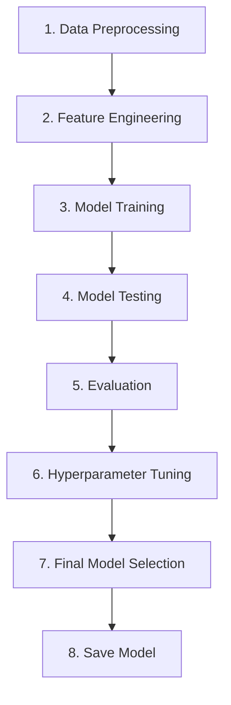

<!-- fullWidth: false tocVisible: false tableWrap: true -->
# Stock Price Prediction - Machine Learning Project

## 📊 Project Description

This project predicts stock prices using Machine Learning algorithms (RandomForest and XGBoost).

## 🚀 Workflow



## 📁 Project Structure

## 🔧 Libraries

```python
import pandas as pd
import joblib
import matplotlib.pyplot as plt
from sklearn.preprocessing import LabelEncoder, MinMaxScaler
from sklearn.model_selection train_test_split, RandomizedSearchCV
from sklearn.metrics r2_score, mean_absolute_error, mean_squared_error
from sklearn.ensemble RandomForestRegressor
from xgboost XGBRegressor
import yfinance as yf
```

## 📈 Features Created

- **Moving Average**: MA_7, MA_14, MA_30
- **Price Change**: Price_Change, Price_Change_7
- **Volatility**: Volatility_7, Volatility_14
- **Technical Indicators**: RSI_14
- **Spread**: HL_Spread, HL_Spread_Pct
- **Volume**: Volume_Change, Volume_MA_7
- **Open-Close**: OC_Diff, OC_Diff_Pct

## 🎯 Model Comparison

| Model        | CV R2  | Test R2 | MAE    | MSE    |
| ------------ | ------ | ------- | ------ | ------ |
| RandomForest | Tuning | Tuning  | Tuning | Tuning |
| XGBoost      | Tuning | Tuning  | Tuning | Tuning |

**Eng yaxshi model**: `best_algorithm.pkl` (XGBoost yoki RandomForest)

## 🏃 How to Run

```bash
# 1. Raw Data yuklash
cd code
python data_loader.py

# 2. Preprocessing
python preprocesser.py

# 3. Feature Engineering
python create_features.py

# 4. Feature Selection
python feature_selection.py

# 5. Training + Tuning
python train.py

# 6. Evaluation
python evaluate.py
```

## 📊 Results

- **evaluation_metrics.csv**: R2, MAE, MSE metrikalar
- **evaluation_result.png**: Grafik (metrikalar ko'rsatiladi)
- **best_algorithm.pkl**: Eng yaxshi model

## 🎓 Bosqichlar Tahlil

### 1\. Data Preprocessing

- **data_loader.py**: Yahoo Finance dan 12 ta stock yuklash (AAPL, TSLA, MSFT...)
- **preprocesser.py**: NULL to'ldir → Object→Number → 0-1 skala

### 2\. Feature Engineering

- **create_features.py**: 14 ta yangi feature yaratish (MA, RSI, Volatility...)
- **feature_selection.py**: Korrelyatsiya → Feature Importance

### 3-4. Model Training + Testing

- **train.py**: Train/Test ajrat → Base model yarat → Prediction olish

### 5\. Evaluation

- **evaluate.py**: R2, MAE, MSE hisoblash → CSV + PNG saqlash

### 6\. Hyperparameter Tuning

- **train.py**: RandomizedSearchCV → Hyperparameter sozlash

### 7\. Final Model Selection

- **train.py**: XGBoost vs RandomForest → Eng yaxshisini tanlash

### 8\. Save Model

- **train.py**: joblib.dump → best_algorithm.pkl saqlash

## 📞 Contact

Khamidjon Ashuraliev\
Seoul, South Korea

---


<!-- fullWidth: false tocVisible: false tableWrap: true -->

<div align="center">

# 🚀 Git Project


<p>
  
  
  
</p>

<p>
  
</p>

</div>

---

## ✨ Loyihaga umumiy qarash

Bu loyiha mashinani o‘qitish uchun to‘liq pipeline hisoblanadi.\
Unda data preprocessing, model training, evaluation va prediction bosqichlari tartibli tarzda joylashtirilgan.

---

## 🎯 Loyihaning maqsadi

Bu loyiha quyidagi vazifalarni bajaradi:

- original yoki tayyorlangan datani yuklash.
- datani tozalash va tayyorlash.
- bir nechta modelni train qilish.
- eng yaxshi modelni tanlash.
- test set ustida baholash.
- yangi data uchun prediction olish.
- log va error fayllarini saqlash.

---

## 🧱 Papkalar tuzilmasi

```bash
git_project/
│
├── Data/
│   ├── raw_data.csv
│   └── Preprocessed_Data/
│       ├── clean_data.csv
│       ├── X_test.csv
│       └── y_test.csv
│
├── models/
│   └── best_algorithm.pkl
│
├── results/
│   ├── train_metrics.csv
│   ├── evaluation_metrics.csv
│   └── evaluation_result.png
│
├── log/
│   ├── train.log
│   ├── evaluate.log
│   ├── predict.log
│   └── preprocess.log
│
├── errors/
│   ├── training_errors.log
│   ├── evaluation_errors.log
│   ├── testing_errors.log
│   └── preprocess_errors.log
│
├── pipeline/
│   ├── train_pipeline.py
│   ├── predict_pipeline.py
│   ├── preprocess.py
│   └── ReadMe.md
│
├── scripts/
│   ├── train.py
│   ├── evaluate.py
│   └── predict.py
│
└── README.md
```

---

## ⚙️ Asosiy imkoniyatlar

- 🧹 Data cleaning va preprocessing.
- 🤖 Bir nechta modelni train qilish.
- 🏆 Eng yaxshi modelni tanlash.
- 📊 Test set ustida evaluation.
- 🔮 Yangi data ustida prediction.
- 📝 Log va error yuritish.
- 💾 Model va natijalarni saqlash.

---

## 🛠️ Ishlatilgan texnologiyalar

<p align="left">
  
  
  
  
  
</p>

---

## 📦 Fayllar vazifasi

### 🔹 `pipeline/preprocess.py`

Raw data bo‘lsa, uni tozalaydi va `clean_data.csv` yaratadi.

### 🔹 `scripts/train.py`

Modelni train qiladi, eng yaxshisini saqlaydi va `X_test.csv`, `y_test.csv` ni yozadi.

### 🔹 `scripts/evaluate.py`

Saqlangan modelni test setda baholaydi.

### 🔹 `scripts/predict.py`

Yangi data uchun prediction qiladi.

### 🔹 `pipeline/train_pipeline.py`

Train workflow’ni boshqaradi.

### 🔹 `pipeline/predict_pipeline.py`

Prediction workflow’ni boshqaradi.

---

## ▶️ Qanday ishga tushirish

### 1\. Data tayyorlash

```bash
python pipeline/preprocess.py
```

### 2\. Model train qilish

```bash
python pipeline/train_pipeline.py
```

### 3\. Modelni baholash

```bash
python scripts/evaluate.py
```

### 4\. Prediction olish

```bash
python scripts/predict.py
```

---

## 📊 Natijalar

- `models/best_algorithm.pkl` — saqlangan eng yaxshi model.
- `results/train_metrics.csv` — training metrikalari.
- `results/evaluation_metrics.csv` — final test metrikalari.
- `results/evaluation_result.png` — visual natija.
- `log/` — barcha loglar.
- `errors/` — barcha error loglar.

---

## 🧩 Muhim eslatmalar

- `clean_data.csv` — training uchun asosiy dataset.
- `X_test.csv` va `y_test.csv` — evaluation uchun saqlanadi.
- Barcha path’lar loyiha root’iga nisbatan yozilgan.
- Loyiha debug qilish va kengaytirish uchun qulay strukturada tuzilgan.

---

## 👨‍💻 Muallif

**Hamidjon**\
Machine Learning & Data Science Project